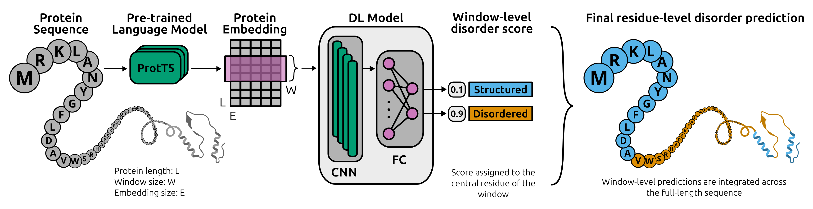

# emb2dis: protein disorder prediction tool
This repository contains a deep learning tool for predicting intrinsically disordered regions (IDRs) in protein sequences. 

This tool generates embeddings from raw protein sequences using a pre-trained protein language model (pLM) and predicts disorder probabilities using a deep learning model that was trained with the **DisProt dataset** (2023_12) and tested on the **CAID3v3** benchmarks. The output of the tool includes per-residue disorder scores, plots of disorder along the sequence and summary statistics.



## Environment setup

1. **Clone the repository:**
```bash
git clone https://github.com/sofiaaduarte/emb2dis.git
cd emb2dis
```

2. **Create a virtual environment**:
```bash
conda create -n emb2dis python=3.11
conda activate emb2dis
```

3. **Install required packages:**
```bash
pip install -r requirements.txt
```
## Usage
The main script is `predict_disorder.py`. You can provide a FASTA file containing one or more protein sequences:
```
python predict_disorder.py --fasta data/samples.fasta
```

This script will:
- Read all sequences from the FASTA file.
- Generate embeddings using the specified pLM (ProtT5 by default).
- Predict disorder scores for each residue using a sliding window approach.
- Save results (CSV and plots) to the output directory (`./results/` by default).
- Print disorder statistics to the console.

### Command-line Arguments
| Argument | Short | Description |
|----------|-------|-------------|
| `--fasta` | `-f` | Path to input FASTA file (required). |
| `--model` | `-m` | Protein language model: `ProtT5` (by default) or `ESM2` |
| `--output-dir` | `-o` | Directory to save predictions (.csv) and plots (.png) (`./results/` by default). |
| `--device` | `-d` | Device: `cpu`, `cuda` (by default), `cuda:0`, etc. |
| `--verbose` | `-v` | Enable verbose output for detailed progress (`False` by default). |

### Examples
**1. Specify output directory and verbose mode:**
```
python predict_disorder.py --fasta data/samples.fasta --output-dir my_results/ --verbose
```
**2. Use ESM2 model on CPU:**
```
python predict_disorder.py --fasta data/samples.fasta --model ESM2 --device cpu
```
**3. Use a specific GPU:**
```
python predict_disorder.py --fasta data/samples.fasta --device cuda:1
```
## Models
### Supported Protein Language Models

| Model | Description | Embedding Size | Reference | Repository |
|-------|-------------|----------------|-----------|------------|
| **ESM2** | ESM-2 (650M parameters) | 1280 | [Lin et al., 2023](https://doi.org/10.1126/science.ade2574) | [facebookresearch/esm](https://github.com/facebookresearch/esm) |
| **ProtT5** | ProtT5-XL (half precision) | 1024 | [Elnaggar et al., 2021](https://doi.org/10.1109/TPAMI.2021.3095381) | [rostlab/ProtTrans](https://github.com/rostlab/ProtTrans) |

The disorder prediction models are trained specifically for each pLM. 

Additional models will be added in future releases.

### Additional notes
- **ESM2 Sequence Limit**: The ESM2 model supports protein sequences up to 1024 residues. Any input exceeding this length will be truncated automatically, and a warning will be issued if this occurs.
- **Sequence preprocessing**: Non-canonical amino acids (U, Z, O, B) are automatically converted to 'X' before generating embeddings.